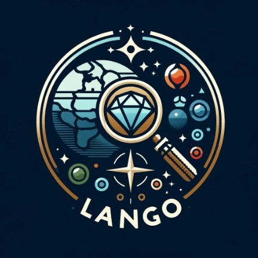

<!-- Improved compatibility of back to top link: See: https://github.com/othneildrew/Best-README-Template/pull/73 -->

<!-- PROJECT LOGO -->
 

  

<h3 align="center">LANGO</h3>

  

    Discover the Earth's Hidden Gems with Lango: Your Ultimate Land Geographic Organizer
     
    <a href="https://github.com/marcosogg/lango_assign1"><strong>Explore the docs »</strong></a>
     
     
    <a href="https://github.com/marcosogg/lango_assign1">View Demo</a>
    ·
    <a href="https://github.com/marcosogg/lango_assign1/issues/new?labels=bug&template=bug-report---.md">Report Bug</a>
    ·
    <a href="https://github.com/marcosogg/lango_assign1/issues/new?labels=enhancement&template=feature-request---.md">Request Feature</a>
  

<!-- TABLE OF CONTENTS -->

  
Table of Contents

  <ol>
    <li>
      <a href="#about-the-project">About The Project</a>
      <ul>
        <li><a href="#built-with">Built With</a></li>
      </ul>
    </li>
    <li>
      <a href="#getting-started">Getting Started</a>
      <ul>
        <li><a href="#prerequisites">Prerequisites</a></li>
        <li><a href="#installation">Installation</a></li>
      </ul>
    </li>
    <li><a href="#usage">Usage</a></li>
    <li><a href="#roadmap">Roadmap</a></li>
    <li><a href="#contributing">Contributing</a></li>
    <li><a href="#license">License</a></li>
    <li><a href="#contact">Contact</a></li>
    <li><a href="#acknowledgments">Acknowledgments</a></li>
  </ol>

<!-- ABOUT THE PROJECT -->

## About The Project

Lango is a point-of-interest (POI) application designed to help users discover and organize fascinating locations around the world. This project fulfills the requirements of Assignment #1 for my Full Stack module within my Computer Science degree program.

[![Product Name Screen Shot][product-screenshot]](https://example.com)

(<a href="#readme-top">back to top</a>)

### Built With

- Frontend:
  Handlebars
  Bulma

- Backend:
  Node.js
  Hapi
  Joi
  MongoDB

(<a href="#readme-top">back to top</a>)

<!-- GETTING STARTED -->

## Getting Started

This is an example of how you may give instructions on setting up your project locally.
To get a local copy up and running follow these simple example steps.

### Prerequisites

Node.js (version X or later)
npm or yarn

### Installation

Steps:

1. Clone the repository: git clone https://github.com/your-username/Lango.git
2. Navigate to the project directory: cd Lango
3. Install dependencies: npm install or yarn install

(<a href="#readme-top">back to top</a>)

<!-- USAGE EXAMPLES -->

## Usage

Start the development server: npm start or yarn start
Open the application in your web browser, typically at http://localhost:3000

(<a href="#readme-top">back to top</a>)

<!-- ROADMAP -->

## Roadmap

See the [open issues](https://github.com/marcosogg/lango_assign1/issues) for a full list of proposed features (and known issues).

(<a href="#readme-top">back to top</a>)

<!-- CONTRIBUTING -->

## Contributing

This is currently an assignment project. However, if you're interested in potential future collaborations or enhancements, feel free to:

Raise an issue for bug reports or feature suggestions.
Fork the repository and create a pull request for code contributions.

1. Fork the Project
2. Create your Feature Branch (`git checkout -b feature/AmazingFeature`)
3. Commit your Changes (`git commit -m 'Add some AmazingFeature'`)
4. Push to the Branch (`git push origin feature/AmazingFeature`)
5. Open a Pull Request

(<a href="#readme-top">back to top</a>)

<!-- LICENSE -->

## License

Distributed under the MIT License. See `LICENSE.txt` for more information.

(<a href="#readme-top">back to top</a>)

<!-- CONTACT -->

## Contact

Marcos - marcosogomes@gmail.com

Project Link: [https://github.com/marcosogg/lango_assign1](https://github.com/marcosogg/lango_assign1)

(<a href="#readme-top">back to top</a>)

<!-- ACKNOWLEDGMENTS -->

## Acknowledgments

(<a href="#readme-top">back to top</a>)

<!-- MARKDOWN LINKS & IMAGES -->
<!-- https://www.markdownguide.org/basic-syntax/#reference-style-links -->

[contributors-shield]: https://img.shields.io/github/contributors/marcosogg/lango_assign1.svg?style=for-the-badge
[contributors-url]: https://github.com/marcosogg/lango_assign1/graphs/contributors
